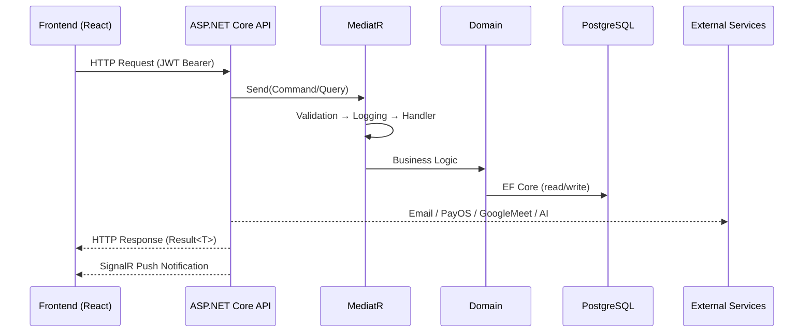

# AuraEyes Backend — ASP.NET Core 8 · Clean Architecture · DDD · CQRS

> **AuraEyes** is an online ophthalmology healthcare platform connecting patients with ophthalmologists and medical organisations. The backend is built with Clean Architecture, Domain-Driven Design (DDD), and the CQRS pattern.

---

## 📋 Table of Contents

- [Architecture Overview](#-architecture-overview)
- [Tech Stack](#-tech-stack)
- [Project Structure](#-project-structure)
- [Domain Model](#-domain-model)
- [Request Flow](#-request-flow)
- [Authentication & Authorization](#-authentication--authorization)
- [Background Jobs & Workers](#-background-jobs--workers)
- [Third-party Integrations](#-third-party-integrations)
- [Environment Configuration](#-environment-configuration)
- [Running with Docker](#-running-with-docker)
- [Running Locally (Development)](#-running-locally-development)
- [API Endpoints](#-api-endpoints)
- [Database & Migrations](#-database--migrations)
- [Testing](#-testing)

---

## 🏛 Architecture Overview

The system consists of 4 layers following Clean Architecture, with dependencies pointing inward:

```
┌──────────────────────────────────────────────────────────────┐
│                       API Layer                              │
│  Controllers · Middleware · SignalR Hubs · Program.cs        │
└────────────────────────┬─────────────────────────────────────┘
                         │ depends on
                         ▼
┌──────────────────────────────────────────────────────────────┐
│                   Application Layer                          │
│  Commands · Queries · Handlers · DTOs · Validators           │
│  Behaviors (Logging, Validation, Performance)                │
└────────────────────────┬─────────────────────────────────────┘
                         │ depends on
                         ▼
┌──────────────────────────────────────────────────────────────┐
│                    Domain Layer                              │
│  Entities · Value Objects · Repository Interfaces           │
│  Domain Events · Enums · Common Base Classes                │
└──────────────────────────────────────────────────────────────┘
                         ▲ implements
┌────────────────────────┴─────────────────────────────────────┐
│                 Infrastructure Layer                         │
│  EF Core · Repositories · Identity · External Services      │
│  Background Jobs · Settings · Interceptors                  │
└──────────────────────────────────────────────────────────────┘
```

---

## 🛠 Tech Stack

### Core Framework

| Component       | Technology                                               |
| --------------- | -------------------------------------------------------- |
| Runtime         | .NET 8.0 / ASP.NET Core 8                                |
| ORM             | Entity Framework Core 8 + Npgsql                         |
| Database        | PostgreSQL 16 (Production: VPS · Dev: Supabase)          |
| Mediator / CQRS | MediatR                                                  |
| Validation      | FluentValidation                                         |
| Mapping         | AutoMapper                                               |
| Logging         | Serilog (Console + File sink)                            |
| API Docs        | Swagger / OpenAPI (Basic Auth protected)                 |
| Auth            | ASP.NET Core Identity + JWT Bearer                       |
| Real-time       | SignalR (`ChatHub`, `NotificationHub`)                   |

### Infrastructure & DevOps

| Component          | Technology                                                          |
| ------------------ | ------------------------------------------------------------------- |
| Background Jobs    | Hangfire (Dashboard, Workers)                                       |
| Background Workers | `IHostedService` (Session Reminder, Reservation Expiration, Consultation State) |
| File Storage       | Cloudinary (primary) · Supabase Storage (legacy)                    |
| Email              | SMTP (Gmail) via MailKit                                            |
| Payment            | PayOS (Checkout + Payout via IPv4-forced HttpClient)                |
| Google Meet        | Google Calendar API v3 (OAuth2 Refresh Token)                       |
| AI                 | Google AI Studio (Gemini) · SerpApi                                 |
| Uptime Monitor     | BetterStack Heartbeat                                               |
| Containerisation   | Docker · Docker Compose (multi-service)                             |
| CI/CD              | GitHub Actions                                                      |

---

## 📁 Project Structure

```
AuraEyes_BE/
├── src/
│   ├── API/                            # Presentation layer
│   │   ├── Controllers/                # REST API controllers
│   │   │   ├── Organization/           # Org-specific controllers
│   │   │   └── SystemAdmin/            # Admin-only controllers
│   │   ├── Hubs/                       # SignalR hubs
│   │   │   ├── ChatHub.cs
│   │   │   └── NotificationHub.cs
│   │   ├── Middleware/                 # Custom middleware (exception, logging, …)
│   │   ├── Services/                   # API-level services
│   │   ├── Program.cs                  # Entry point & DI composition root
│   │   └── appsettings.json
│   │
│   ├── Application/                    # Business rules & use cases
│   │   ├── Common/                     # Shared interfaces, behaviors, models
│   │   │   ├── Behaviors/              # MediatR pipeline (Validation, Logging, Performance)
│   │   │   ├── Interfaces/             # Application-level interfaces
│   │   │   ├── Models/                 # Result<T>, PagedResult<T>
│   │   │   └── Constants/              # Roles, Policies, Permissions
│   │   ├── Auth/                       # Authentication use cases
│   │   ├── Patients/                   # Patient management
│   │   ├── Ophthalmologists/           # Ophthalmologist management
│   │   ├── Organisations/              # Organisation management
│   │   ├── OrganisationPatients/       # Org ↔ Patient linking
│   │   ├── Scheduling/                 # Schedule templates & appointment slots
│   │   ├── ConsultationSessions/       # Telemedicine sessions
│   │   ├── Screenings/                 # AI retinal screening flow
│   │   ├── OphthalmologistScreenings/  # Doctor-side screening review
│   │   ├── OrganisationScreenings/     # Organisation-level screening reports
│   │   ├── PatientRoadmaps/            # AI-generated treatment roadmaps
│   │   ├── Wallets/                    # Wallet & payment operations
│   │   ├── Network/                    # Posts & doctor network
│   │   ├── Notifications/              # Push notifications
│   │   ├── Feedback/                   # Feedback & ratings
│   │   ├── Consents/                   # Patient consents (PDPA)
│   │   ├── AiQuota/                    # AI usage quota management
│   │   ├── SystemAdmin/                # System admin operations
│   │   └── SystemSettings/             # Dynamic system configuration
│   │
│   ├── Domain/                         # Core business model (no external dependencies)
│   │   ├── Common/                     # BaseEntity, IAggregateRoot, IDomainEvent
│   │   ├── Entities/
│   │   │   ├── Users/                  # Ophthalmologist, Patient, Organisation, …
│   │   │   ├── Scheduling/             # Appointment, AppointmentSlot, ScheduleTemplate, …
│   │   │   ├── Screening/              # AiScreening, MedicalDiagnosis, RetinalImage, …
│   │   │   ├── Financial/              # Wallet, DepositRequest, WithdrawalRequest, …
│   │   │   ├── Consultation/           # ConsultationSession
│   │   │   ├── Network/                # Post
│   │   │   ├── Platform/               # SystemSetting
│   │   │   ├── Authorization/          # Permission
│   │   │   └── Contracts/              # ContractTemplate, Contract
│   │   ├── Enums/                      # Domain enumerations
│   │   ├── Repositories/               # Repository interfaces
│   │   └── ValueObjects/               # Immutable value types
│   │
│   └── Infrastructure/                 # External dependencies & implementations
│       ├── Identity/                   # ASP.NET Core Identity (ApplicationUser, ApplicationRole)
│       │   └── Authorization/          # Permission-based Handler & Requirement
│       ├── Persistence/                # EF Core
│       │   ├── ApplicationDbContext.cs
│       │   ├── Configurations/         # Fluent API entity configurations
│       │   ├── Interceptors/           # AuditInterceptor (auto CreatedAt/UpdatedAt)
│       │   ├── Migrations/
│       │   ├── Queries/                # Raw read-optimised query handlers
│       │   └── Repositories/           # Repository implementations
│       ├── Services/                   # Service implementations
│       │   ├── EmailService.cs
│       │   ├── CloudinaryStorageService.cs
│       │   ├── GoogleMeetService.cs
│       │   ├── PayOSService.cs / PayOSPayoutService.cs
│       │   ├── PatientRoadmapGenerationService.cs (AI)
│       │   ├── OrganisationScreeningPdfService.cs
│       │   ├── NotificationService.cs
│       │   ├── DatabaseSeeder.cs
│       │   ├── ConsultationStateWorker.cs
│       │   ├── SessionReminderWorker.cs
│       │   ├── ReservationExpirationWorker.cs
│       │   └── … (28 services total)
│       ├── CommandHandlers/            # Infrastructure-owned command handlers
│       ├── QueryHandlers/              # Infrastructure-owned query handlers
│       └── Settings/                   # Strongly-typed settings (JwtSettings, SmtpSettings, …)
│
├── tests/                              # xUnit test projects
├── docs/                               # Additional documentation
├── scripts/                            # Helper scripts
├── tools/                              # Dev tooling
├── Dockerfile
├── docker-compose.yml
├── .env.example
├── .github/                            # GitHub Actions CI/CD workflows
└── AuraEyes_BE.sln
```

---

## 🗂 Domain Model

### Entity Groups

#### 👤 Users

| Entity                                       | Description                                                |
| -------------------------------------------- | ---------------------------------------------------------- |
| `Ophthalmologist`                            | Ophthalmologist with profile, certification, employment type |
| `Patient`                                    | Patient with personal information and CitizenId            |
| `Organisation`                               | Organisation / clinic                                      |
| `OrganisationPatientLink`                    | Many-to-Many link between organisation and patient         |
| `Consent`                                    | Data sharing consent (PDPA)                                |
| `Certificate`                                | Doctor's practice certificate                              |
| `OphthalmologistEmploymentTypeChangeRequest` | Request to change employment contract type                 |
| `OrganisationOnboardingRequest`              | Organisation onboarding request                            |

#### 📅 Scheduling

| Entity                         | Description                                      |
| ------------------------------ | ------------------------------------------------ |
| `ScheduleTemplate`             | Doctor's work schedule template                  |
| `AppointmentSlot`              | Time slot generated from a schedule template     |
| `Appointment`                  | Appointment booked by a patient                  |
| `OphthalmologistLeaveRequest`  | Leave request                                    |
| `ExperiencePricingRule`        | Pricing rule based on doctor experience          |

#### 🔬 Screening (AI Retinal)

| Entity            | Description                              |
| ----------------- | ---------------------------------------- |
| `AiScreening`     | AI screening session (contains retinal images) |
| `RetinalImage`    | Uploaded retinal image                   |
| `ScreeningResult` | AI-generated result                      |
| `MedicalDiagnosis`| Doctor's clinical diagnosis              |
| `PatientRoadmap`  | AI-generated treatment roadmap           |

#### 💊 Consultation

| Entity                | Description                                      |
| --------------------- | ------------------------------------------------ |
| `ConsultationSession` | Online consultation session via Google Meet      |

#### 💰 Financial

| Entity               | Description                          |
| -------------------- | ------------------------------------ |
| `Wallet`             | Doctor / organisation digital wallet |
| `WalletTransaction`  | Wallet transaction history           |
| `DepositRequest`     | Deposit request (PayOS)              |
| `WithdrawalRequest`  | Withdrawal request                   |
| `Order`              | Order                                |
| `Payment`            | Payment record                       |

#### 🌐 Network & Platform

| Entity             | Description                         |
| ------------------ | ----------------------------------- |
| `Post`             | Doctor's post on the network feed   |
| `Permission`       | RBAC permission                     |
| `ContractTemplate` | Contract template                   |
| `Contract`         | Signed contract                     |

---

## 🔄 Request Flow

### Command Flow (Write — CUD)

```
HTTP Request
    │
    ▼
Controller (API Layer)
    │  send(Command)
    ▼
MediatR Pipeline
    ├── ValidationBehavior     ← FluentValidation
    ├── LoggingBehavior        ← Serilog
    └── PerformanceBehavior    ← warns on queries > 500ms
         │
         ▼
    CommandHandler (Application)
         ├── Repository.GetByIdAsync()
         ├── Entity.BusinessMethod()   ← Domain logic & invariants
         ├── Repository.AddAsync() / Update()
         └── UnitOfWork.SaveChangesAsync()
              └── AuditInterceptor     ← auto-sets CreatedAt / UpdatedAt
              └── Dispatch Domain Events
         │
         ▼
    Result<T>
         │
         ▼
HTTP Response (200/201/400/404/409)
```

### Query Flow (Read)

```
HTTP Request
    │
    ▼
Controller (API Layer)
    │  send(Query)
    ▼
MediatR Pipeline
    ├── LoggingBehavior
    └── QueryHandler  (Application or Infrastructure/QueryHandlers)
         ├── Repository / Raw Query / LINQ
         └── Map Entity → DTO
         │
         ▼
    Result<DTO> / PagedResult<DTO>
         │
         ▼
HTTP Response (200 OK)
```

### Real-time Flow (SignalR)

```
Client (WS/SSE)
    │  connect with JWT ?access_token=...
    ▼
NotificationHub / ChatHub
    │
    ▼
NotificationService.SendAsync()
    └── Clients.User(userId).SendAsync("event", payload)
```

---

## 🔐 Authentication & Authorization

### Mechanisms

- **ASP.NET Core Identity** stores users/roles in PostgreSQL (`AspNetUsers`, `AspNetRoles`, …)
- **JWT Bearer** — Access Token (60 minutes) + Refresh Token (7 days)
- **Google OAuth2** — Sign in with Google

### System Roles

| Role              | Description               |
| ----------------- | ------------------------- |
| `Patient`         | Patient                   |
| `Ophthalmologist` | Ophthalmologist           |
| `OrgAdmin`        | Organisation administrator |
| `SystemAdmin`     | System administrator      |

### Authorization Policies

| Policy                        | Condition                                          |
| ----------------------------- | -------------------------------------------------- |
| `Authenticated`               | User is authenticated                              |
| `PatientOnly`                 | Role = Patient                                     |
| `OphthalmologistOnly`         | Role = Ophthalmologist                             |
| `OrgAdminOnly`                | Role = OrgAdmin                                    |
| `SystemAdminOnly`             | Role = SystemAdmin                                 |
| `MedicalStaff`                | Ophthalmologist or OrgAdmin                        |
| `VerifiedOphthalmologist`     | Ophthalmologist + Claim `IsVerified=True`          |
| `OrganizationMember`          | Claim `org_id` exists                              |
| Dynamic Permission Policies   | From `Permissions` class (granular RBAC)           |

---

## ⏱ Background Jobs & Workers

### IHostedService (always-running)

| Worker                        | Function                                         |
| ----------------------------- | ------------------------------------------------ |
| `SessionReminderWorker`       | Sends reminder emails before consultation sessions |
| `ReservationExpirationWorker` | Cancels expired slot reservations                |
| `ConsultationStateWorker`     | Updates consultation session state               |

### Hangfire Jobs (scheduled)

| Job                         | Frequency | Function                            |
| --------------------------- | --------- | ----------------------------------- |
| `DailyQuotaResetJob`        | Daily     | Resets daily AI quota               |
| `MonthlyQuotaResetJob`      | Monthly   | Resets monthly AI quota             |
| `SlotMaintenanceJob`        | Periodic  | Cleans up stale slots               |
| `FullTimeSlotGenerationJob` | Periodic  | Generates slots from schedule templates |

---

## 🔌 Third-party Integrations

| Service                       | Purpose                                              |
| ----------------------------- | ---------------------------------------------------- |
| **PayOS**                     | Payment gateway (checkout link + payout)             |
| **Cloudinary**                | Storage for retinal images, avatars, documents       |
| **Google Meet (Calendar API v3)** | Creates meeting links for consultation sessions  |
| **Google AI Studio (Gemini)** | Generates treatment roadmaps, patient analysis       |
| **Google OAuth2**             | Sign in with Google                                  |
| **SerpApi**                   | Medical resource search                              |
| **SMTP (Gmail)**              | OTP verification emails, reminders, notifications    |
| **BetterStack**               | Uptime monitoring & heartbeat                        |
| **Supabase Storage**          | Legacy file storage                                  |

---

## ⚙️ Environment Configuration

Copy `.env.example` → `.env` and fill in the values:

```bash
cp .env.example .env
```

### Key Configuration Groups

```env
# Database
DB_USER=postgres
DB_PASSWORD=<strong_password>
DB_NAME=auraeyes

# API
API_PORT=5060
ASPNETCORE_ENVIRONMENT=Production

# Connection String (Docker — host = service 'db')
ConnectionStrings__DefaultConnection=Host=db;Port=5432;Database=auraeyes;...

# JWT
JwtSettings__SecretKey=<64_char_secret>
JwtSettings__Issuer=AuraEyesAPI
JwtSettings__Audience=AuraEyesClient
JwtSettings__AccessTokenExpiryMinutes=60
JwtSettings__RefreshTokenExpiryDays=7

# SMTP
Smtp__Host=smtp.gmail.com
Smtp__Port=587
Smtp__Username=your@gmail.com
Smtp__Password=<app_password>

# PayOS
PayOS__ClientId=
PayOS__ApiKey=
PayOS__ChecksumKey=

# Cloudinary
Cloudinary__CloudName=
Cloudinary__ApiKey=
Cloudinary__ApiSecret=

# Google
GoogleAuth__ClientId=
GoogleMeet__ClientId=
GoogleMeet__ClientSecret=
GoogleMeet__RefreshToken=

# Google AI Studio
GoogleAiStudio__ApiKey=

# Hangfire
Hangfire__ServerEnabled=true
Hangfire__WorkerCount=1

# Frontend Base URL
BaseUrl=https://auraeyes.site
```

> 📌 See `.env.example` for the full list of all available variables.

---

## 🐳 Running with Docker

### Docker Compose Services

| Service   | Image                        | Port                 |
| --------- | ---------------------------- | -------------------- |
| `db`      | `postgres:16-alpine`         | Internal only        |
| `api`     | `{DOCKER_IMAGE_NAME}:latest` | `${API_PORT}:8080`   |
| `pgadmin` | `dpage/pgadmin4`             | `127.0.0.1:5050:80`  |

```bash
# 1. Create .env from example
cp .env.example .env

# 2. Start the full stack
docker compose up -d

# 3. Check health
docker compose ps
curl http://localhost:5060/health

# 4. Access pgAdmin via SSH tunnel
ssh -L 5050:localhost:5050 user@vps
# Open in browser: http://localhost:5050

# 5. View API logs
docker compose logs -f api
```

### PostgreSQL tuned with:

- `max_connections=300`
- `shared_buffers=512MB`
- `statement_timeout=60s`
- `log_min_duration_statement=1000ms`

---

## 💻 Running Locally (Development)

### Requirements

- .NET 8 SDK
- PostgreSQL 16 (or a Supabase connection)
- Visual Studio 2022 / Rider / VS Code

### Setup

```bash
# 1. Clone the repository
git clone https://github.com/AuraEyesOrg/AuraEyes_BE.git
cd AuraEyes_BE

# 2. Configure Development settings
# Edit src/API/appsettings.Development.json
# or copy .env.example → .env (if using docker for dev)

# 3. Run migrations
cd src/Infrastructure
dotnet ef migrations add InitialCreate --startup-project ../API
dotnet ef database update --startup-project ../API

# 4. Run the application
cd ../API
dotnet run

# 5. Swagger UI (development)
# https://localhost:5001/swagger
```

---

## 🌐 API Endpoints

| Controller                            | Base Route                        | Function                                        |
| ------------------------------------- | --------------------------------- | ----------------------------------------------- |
| `AuthController`                      | `/api/auth`                       | Register, login, refresh, OTP, Google login     |
| `TwoFactorController`                 | `/api/2fa`                        | 2FA management                                  |
| `PatientsController`                  | `/api/patients`                   | Patient CRUD                                    |
| `PatientProfileController`            | `/api/patient-profile`            | Patient personal profile                        |
| `PatientSearchController`             | `/api/patient-search`             | Patient search                                  |
| `PatientResourcesController`          | `/api/patient-resources`          | AI medical resources                            |
| `PatientRoadmapsController`           | `/api/patient-roadmaps`           | AI treatment roadmaps                           |
| `OphthalmologistsController`          | `/api/ophthalmologists`           | Doctor management, profile, certifications      |
| `OphthalmologistScreeningsController` | `/api/ophthalmologist-screenings` | Doctor screening review                         |
| `ScreeningsController`                | `/api/screenings`                 | AI retinal screening                            |
| `ConsultationSessionsController`      | `/api/consultation-sessions`      | Consultation sessions (Google Meet)             |
| `AppointmentSlotsController`          | `/api/appointment-slots`          | Appointment slot management                     |
| `ScheduleTemplatesController`         | `/api/schedule-templates`         | Work schedule templates                         |
| `WalletsController`                   | `/api/wallets`                    | Wallet, deposits, withdrawals, history          |
| `NetworkController`                   | `/api/network`                    | Medical network posts                           |
| `NotificationsController`             | `/api/notifications`              | Notifications                                   |
| `FeedbackController`                  | `/api/feedback`                   | Ratings & reviews                               |
| `ConsentsController`                  | `/api/consents`                   | Data sharing consents                           |
| `SystemSettingsController`            | `/api/system-settings`            | System configuration                            |
| `QuotasController`                    | `/api/quotas`                     | AI quota management                             |
| Organisation controllers              | `/api/org/…`                      | Organisation, onboarding, screening PDF reports |
| SystemAdmin controllers               | `/api/admin/…`                    | Dashboard, full system administration           |
| `GET /health`                         | —                                 | Health check                                    |
| `GET /hangfire`                       | —                                 | Hangfire Dashboard (Admin)                      |

---

## 🗄 Database & Migrations

Uses **Entity Framework Core** with **PostgreSQL 16** and **Fluent API**.

```bash
# Add a new migration
cd src/Infrastructure
dotnet ef migrations add <MigrationName> --startup-project ../API

# Apply migrations to the database
dotnet ef database update --startup-project ../API

# Roll back a migration
dotnet ef database update <PreviousMigrationName> --startup-project ../API

# List migration history
dotnet ef migrations list --startup-project ../API
```

### Automatic Auditing

`AuditInterceptor` automatically sets `CreatedAt` and `UpdatedAt` on all entities inheriting from `BaseEntity`, with no need for manual assignment in handlers.

---

## 🧪 Testing

```bash
# Run all unit tests
dotnet test tests/

# Run with coverage
dotnet test tests/ --collect:"XPlat Code Coverage"
```

Test projects are located in the `tests/` directory. Uses **xUnit** as per project standards.

---

## 🏗 Architecture Summary — End-to-End Request Flow



---

*© 2026 AuraEyes Team — SEP490 · FPT University*
