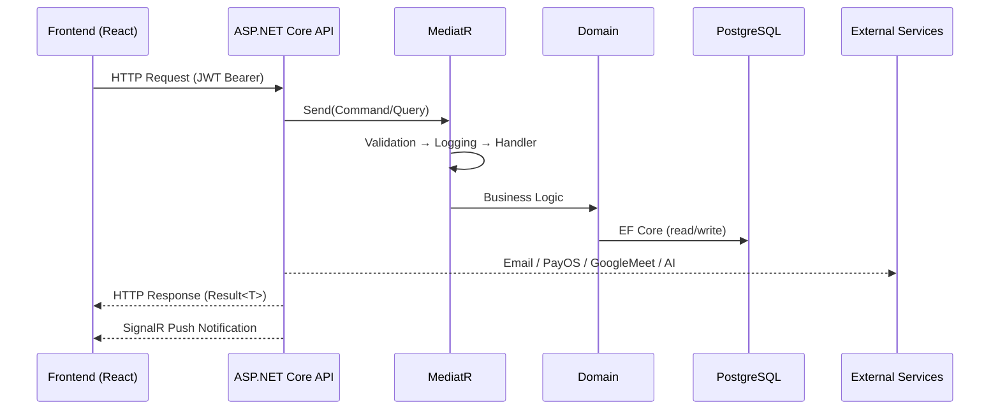

# AuraEyes Backend — ASP.NET Core 8 · Clean Architecture · DDD · CQRS

> **AuraEyes** là nền tảng chăm sóc sức khoẻ nhãn khoa trực tuyến, kết nối bệnh nhân với bác sĩ nhãn khoa và các tổ chức y tế. Backend được xây dựng theo Clean Architecture + Domain-Driven Design + CQRS.

---

## 📋 Mục lục

- [Tổng quan kiến trúc](#-tổng-quan-kiến-trúc)
- [Tech Stack](#-tech-stack)
- [Cấu trúc thư mục](#-cấu-trúc-thư-mục)
- [Domain Model](#-domain-model)
- [Request Flow](#-request-flow)
- [Authentication & Authorization](#-authentication--authorization)
- [Background Jobs & Workers](#-background-jobs--workers)
- [Tích hợp bên thứ ba](#-tích-hợp-bên-thứ-ba)
- [Cấu hình môi trường](#-cấu-hình-môi-trường)
- [Chạy với Docker](#-chạy-với-docker)
- [Chạy local (Development)](#-chạy-local-development)
- [API Endpoints](#-api-endpoints)
- [Database & Migrations](#-database--migrations)
- [Testing](#-testing)

---

## 🏛 Tổng quan kiến trúc

Hệ thống bao gồm 4 layer theo Clean Architecture, với quy tắc phụ thuộc hướng vào trong:

```
┌──────────────────────────────────────────────────────────────┐
│                       API Layer                              │
│  Controllers · Middleware · SignalR Hubs · Program.cs        │
└────────────────────────┬─────────────────────────────────────┘
                         │ depends on
                         ▼
┌──────────────────────────────────────────────────────────────┐
│                   Application Layer                          │
│  Commands · Queries · Handlers · DTOs · Validators           │
│  Behaviors (Logging, Validation, Performance)                │
└────────────────────────┬─────────────────────────────────────┘
                         │ depends on
                         ▼
┌──────────────────────────────────────────────────────────────┐
│                    Domain Layer                              │
│  Entities · Value Objects · Repository Interfaces           │
│  Domain Events · Enums · Common Base Classes                │
└──────────────────────────────────────────────────────────────┘
                         ▲ implements
┌────────────────────────┴─────────────────────────────────────┐
│                 Infrastructure Layer                         │
│  EF Core · Repositories · Identity · External Services      │
│  Background Jobs · Settings · Interceptors                  │
└──────────────────────────────────────────────────────────────┘
```

---

## 🛠 Tech Stack

### Core Framework
| Thành phần | Công nghệ |
|---|---|
| Runtime | .NET 8.0 / ASP.NET Core 8 |
| ORM | Entity Framework Core 8 + Npgsql |
| Database | PostgreSQL 16 (Production: VPS · Dev: Supabase) |
| Mediator / CQRS | MediatR |
| Validation | FluentValidation |
| Mapping | AutoMapper |
| Logging | Serilog (Console + File sink) |
| API Docs | Swagger / OpenAPI (Basic Auth protected) |
| Auth | ASP.NET Core Identity + JWT Bearer |
| Real-time | SignalR (`ChatHub`, `NotificationHub`) |

### Infrastructure & DevOps
| Thành phần | Công nghệ |
|---|---|
| Background Jobs | Hangfire (Dashboard, Workers) |
| Background Workers | `IHostedService` (Session Reminder, Reservation Expiration, Consultation State) |
| File Storage | Cloudinary (primary) · Supabase Storage (legacy) |
| Email | SMTP (Gmail) via MailKit |
| Payment | PayOS (Checkout + Payout via IPv4-forced HttpClient) |
| Google Meet | Google Calendar API v3 (OAuth2 Refresh Token) |
| AI | Google AI Studio (Gemini) · SerpApi |
| Uptime Monitor | BetterStack Heartbeat |
| Containerization | Docker · Docker Compose (multi-service) |
| CI/CD | GitHub Actions |

---

## 📁 Cấu trúc thư mục

```
AuraEyes_BE/
├── src/
│   ├── API/                            # Presentation layer
│   │   ├── Controllers/                # REST API controllers
│   │   │   ├── Organization/           # Org-specific controllers
│   │   │   └── SystemAdmin/            # Admin-only controllers
│   │   ├── Hubs/                       # SignalR hubs
│   │   │   ├── ChatHub.cs
│   │   │   └── NotificationHub.cs
│   │   ├── Middleware/                 # Custom middleware (exception, logging, …)
│   │   ├── Services/                   # API-level services
│   │   ├── Program.cs                  # Entry point & DI composition root
│   │   └── appsettings.json
│   │
│   ├── Application/                    # Business rules & use cases
│   │   ├── Common/                     # Shared interfaces, behaviors, models
│   │   │   ├── Behaviors/              # MediatR pipeline (Validation, Logging, Performance)
│   │   │   ├── Interfaces/             # Application-level interfaces
│   │   │   ├── Models/                 # Result<T>, PagedResult<T>
│   │   │   └── Constants/              # Roles, Policies, Permissions
│   │   ├── Auth/                       # Authentication use cases
│   │   ├── Patients/                   # Patient management
│   │   ├── Ophthalmologists/           # Ophthalmologist management
│   │   ├── Organisations/              # Organisation management
│   │   ├── OrganisationPatients/       # Org ↔ Patient linking
│   │   ├── Scheduling/                 # Schedule templates & appointment slots
│   │   ├── ConsultationSessions/       # Telemedicine sessions
│   │   ├── Screenings/                 # AI retinal screening flow
│   │   ├── OphthalmologistScreenings/  # Doctor-side screening review
│   │   ├── OrganisationScreenings/     # Organisation-level screening reports
│   │   ├── PatientRoadmaps/            # AI-generated treatment roadmaps
│   │   ├── Wallets/                    # Wallet & payment operations
│   │   ├── Network/                    # Posts & doctor network
│   │   ├── Notifications/              # Push notifications
│   │   ├── Feedback/                   # Feedback & ratings
│   │   ├── Consents/                   # Patient consents (PDPA)
│   │   ├── AiQuota/                    # AI usage quota management
│   │   ├── SystemAdmin/                # System admin operations
│   │   └── SystemSettings/             # Dynamic system config
│   │
│   ├── Domain/                         # Core business model (no external deps)
│   │   ├── Common/                     # BaseEntity, IAggregateRoot, IDomainEvent
│   │   ├── Entities/
│   │   │   ├── Users/                  # Ophthalmologist, Patient, Organisation, …
│   │   │   ├── Scheduling/             # Appointment, AppointmentSlot, ScheduleTemplate, …
│   │   │   ├── Screening/              # AiScreening, MedicalDiagnosis, RetinalImage, …
│   │   │   ├── Financial/              # Wallet, DepositRequest, WithdrawalRequest, …
│   │   │   ├── Consultation/           # ConsultationSession
│   │   │   ├── Network/                # Post
│   │   │   ├── Platform/               # SystemSetting
│   │   │   ├── Authorization/          # Permission
│   │   │   └── Contracts/              # ContractTemplate, Contract
│   │   ├── Enums/                      # Domain enumerations
│   │   ├── Repositories/               # Repository interfaces
│   │   └── ValueObjects/               # Immutable value types
│   │
│   └── Infrastructure/                 # External dependencies & implementations
│       ├── Identity/                   # ASP.NET Core Identity (ApplicationUser, ApplicationRole)
│       │   └── Authorization/          # Permission-based Handler & Requirement
│       ├── Persistence/                # EF Core
│       │   ├── ApplicationDbContext.cs
│       │   ├── Configurations/         # Fluent API entity configs
│       │   ├── Interceptors/           # AuditInterceptor (auto CreatedAt/UpdatedAt)
│       │   ├── Migrations/
│       │   ├── Queries/                # Raw read-optimised query handlers
│       │   └── Repositories/           # Repository implementations
│       ├── Services/                   # Service implementations
│       │   ├── EmailService.cs
│       │   ├── CloudinaryStorageService.cs
│       │   ├── GoogleMeetService.cs
│       │   ├── PayOSService.cs / PayOSPayoutService.cs
│       │   ├── PatientRoadmapGenerationService.cs (AI)
│       │   ├── OrganisationScreeningPdfService.cs
│       │   ├── NotificationService.cs
│       │   ├── DatabaseSeeder.cs
│       │   ├── ConsultationStateWorker.cs
│       │   ├── SessionReminderWorker.cs
│       │   ├── ReservationExpirationWorker.cs
│       │   └── … (28 services total)
│       ├── CommandHandlers/            # Infrastructure-owned command handlers
│       ├── QueryHandlers/              # Infrastructure-owned query handlers
│       └── Settings/                   # Strongly-typed settings (JwtSettings, SmtpSettings, …)
│
├── tests/                              # xUnit test projects
├── docs/                               # Additional documentation
├── scripts/                            # Helper scripts
├── tools/                              # Dev tooling
├── Dockerfile
├── docker-compose.yml
├── .env.example
├── .github/                            # GitHub Actions CI/CD workflows
└── AuraEyes_BE.sln
```

---

## 🗂 Domain Model

### Nhóm thực thể chính

#### 👤 Users
| Entity | Mô tả |
|---|---|
| `Ophthalmologist` | Bác sĩ nhãn khoa với profile, certification, employment type |
| `Patient` | Bệnh nhân với thông tin cá nhân, CitizenId |
| `Organisation` | Tổ chức / phòng khám |
| `OrganisationPatientLink` | Liên kết Many-to-Many tổ chức ↔ bệnh nhân |
| `Consent` | Chấp thuận chia sẻ dữ liệu (PDPA) |
| `Certificate` | Chứng chỉ hành nghề của bác sĩ |
| `OphthalmologistEmploymentTypeChangeRequest` | Yêu cầu đổi loại hình hợp đồng |
| `OrganisationOnboardingRequest` | Yêu cầu onboarding tổ chức |

#### 📅 Scheduling
| Entity | Mô tả |
|---|---|
| `ScheduleTemplate` | Lịch làm việc mẫu của bác sĩ |
| `AppointmentSlot` | Slot giờ hẹn được tạo từ template |
| `Appointment` | Lịch hẹn đã được đặt bởi bệnh nhân |
| `OphthalmologistLeaveRequest` | Yêu cầu nghỉ phép |
| `ExperiencePricingRule` | Quy tắc định giá theo kinh nghiệm |

#### 🔬 Screening (AI Retinal)
| Entity | Mô tả |
|---|---|
| `AiScreening` | Phiên sàng lọc AI (chứa ảnh võng mạc) |
| `RetinalImage` | Ảnh võng mạc được upload |
| `ScreeningResult` | Kết quả AI trả về |
| `MedicalDiagnosis` | Chẩn đoán của bác sĩ |
| `PatientRoadmap` | Lộ trình điều trị do AI sinh |

#### 💊 Consultation
| Entity | Mô tả |
|---|---|
| `ConsultationSession` | Phiên tư vấn trực tuyến qua Google Meet |

#### 💰 Financial
| Entity | Mô tả |
|---|---|
| `Wallet` | Ví điện tử của bác sĩ / tổ chức |
| `WalletTransaction` | Lịch sử giao dịch ví |
| `DepositRequest` | Yêu cầu nạp tiền (PayOS) |
| `WithdrawalRequest` | Yêu cầu rút tiền |
| `Order` | Đơn hàng |
| `Payment` | Thanh toán |

#### 🌐 Network & Platform
| Entity | Mô tả |
|---|---|
| `Post` | Bài đăng của bác sĩ trên mạng lưới |
| `Permission` | Phân quyền RBAC |
| `ContractTemplate` | Mẫu hợp đồng |
| `Contract` | Hợp đồng đã ký |

---

## 🔄 Request Flow

### Command Flow (Write — CUD)

```
HTTP Request
    │
    ▼
Controller (API Layer)
    │  send(Command)
    ▼
MediatR Pipeline
    ├── ValidationBehavior     ← FluentValidation
    ├── LoggingBehavior        ← Serilog
    └── PerformanceBehavior    ← cảnh báo query > 500ms
         │
         ▼
    CommandHandler (Application)
         ├── Repository.GetByIdAsync()
         ├── Entity.BusinessMethod()   ← Domain logic & invariants
         ├── Repository.AddAsync() / Update()
         └── UnitOfWork.SaveChangesAsync()
              └── AuditInterceptor     ← tự gán CreatedAt / UpdatedAt
              └── Dispatch Domain Events
         │
         ▼
    Result<T>
         │
         ▼
HTTP Response (200/201/400/404/409)
```

### Query Flow (Read)

```
HTTP Request
    │
    ▼
Controller (API Layer)
    │  send(Query)
    ▼
MediatR Pipeline
    ├── LoggingBehavior
    └── QueryHandler  (Application hoặc Infrastructure/QueryHandlers)
         ├── Repository / Raw Query / Dapper-style LINQ
         └── Map Entity → DTO
         │
         ▼
    Result<DTO> / PagedResult<DTO>
         │
         ▼
HTTP Response (200 OK)
```

### Real-time Flow (SignalR)

```
Client (WS/SSE)
    │  connect với JWT ?access_token=...
    ▼
NotificationHub / ChatHub
    │
    ▼
NotificationService.SendAsync()
    └── Clients.User(userId).SendAsync("event", payload)
```

---

## 🔐 Authentication & Authorization

### Cơ chế
- **ASP.NET Core Identity** lưu user/role trong PostgreSQL (`AspNetUsers`, `AspNetRoles`, …)
- **JWT Bearer** — Access Token (60 phút) + Refresh Token (7 ngày)
- **Google OAuth2** — Đăng nhập bằng Google

### Roles hệ thống
| Role | Mô tả |
|---|---|
| `Patient` | Bệnh nhân |
| `Ophthalmologist` | Bác sĩ nhãn khoa |
| `OrgAdmin` | Quản trị tổ chức |
| `SystemAdmin` | Quản trị hệ thống |

### Authorization Policies
| Policy | Điều kiện |
|---|---|
| `Authenticated` | Đã đăng nhập |
| `PatientOnly` | Role = Patient |
| `OphthalmologistOnly` | Role = Ophthalmologist |
| `OrgAdminOnly` | Role = OrgAdmin |
| `SystemAdminOnly` | Role = SystemAdmin |
| `MedicalStaff` | Ophthalmologist hoặc OrgAdmin |
| `VerifiedOphthalmologist` | Ophthalmologist + Claim `IsVerified=True` |
| `OrganizationMember` | Claim `org_id` tồn tại |
| Dynamic Permission Policies | Từ class `Permissions` (RBAC granular) |

---

## ⏱ Background Jobs & Workers

### IHostedService (chạy liên tục)
| Worker | Chức năng |
|---|---|
| `SessionReminderWorker` | Gửi email nhắc nhở trước phiên tư vấn |
| `ReservationExpirationWorker` | Huỷ slot đặt chỗ hết hạn |
| `ConsultationStateWorker` | Cập nhật trạng thái phiên tư vấn |

### Hangfire Jobs (định kỳ)
| Job | Tần suất | Chức năng |
|---|---|---|
| `DailyQuotaResetJob` | Hằng ngày | Reset quota AI hằng ngày |
| `MonthlyQuotaResetJob` | Hằng tháng | Reset quota AI hằng tháng |
| `SlotMaintenanceJob` | Định kỳ | Dọn slot rác |
| `FullTimeSlotGenerationJob` | Định kỳ | Sinh slot từ schedule template |

---

## 🔌 Tích hợp bên thứ ba

| Service | Mục đích |
|---|---|
| **PayOS** | Cổng thanh toán (checkout link + payout) |
| **Cloudinary** | Lưu trữ ảnh võng mạc, avatar, tài liệu |
| **Google Meet (Calendar API v3)** | Tạo link họp cho phiên tư vấn |
| **Google AI Studio (Gemini)** | Sinh lộ trình điều trị, phân tích bệnh nhân |
| **Google OAuth2** | Đăng nhập bằng Google |
| **SerpApi** | Tìm kiếm tài nguyên y tế |
| **SMTP (Gmail)** | Gửi email xác thực OTP, nhắc nhở, thông báo |
| **BetterStack** | Uptime monitoring & heartbeat |
| **Supabase Storage** | Legacy file storage |

---

## ⚙️ Cấu hình môi trường

Copy `.env.example` → `.env` và điền giá trị:

```bash
cp .env.example .env
```

### Các nhóm cấu hình chính

```env
# Database
DB_USER=postgres
DB_PASSWORD=<strong_password>
DB_NAME=auraeyes

# API
API_PORT=5060
ASPNETCORE_ENVIRONMENT=Production

# Connection String (Docker — host = service 'db')
ConnectionStrings__DefaultConnection=Host=db;Port=5432;Database=auraeyes;...

# JWT
JwtSettings__SecretKey=<64_char_secret>
JwtSettings__Issuer=AuraEyesAPI
JwtSettings__Audience=AuraEyesClient
JwtSettings__AccessTokenExpiryMinutes=60
JwtSettings__RefreshTokenExpiryDays=7

# SMTP
Smtp__Host=smtp.gmail.com
Smtp__Port=587
Smtp__Username=your@gmail.com
Smtp__Password=<app_password>

# PayOS
PayOS__ClientId=
PayOS__ApiKey=
PayOS__ChecksumKey=

# Cloudinary
Cloudinary__CloudName=
Cloudinary__ApiKey=
Cloudinary__ApiSecret=

# Google
GoogleAuth__ClientId=
GoogleMeet__ClientId=
GoogleMeet__ClientSecret=
GoogleMeet__RefreshToken=

# Google AI Studio
GoogleAiStudio__ApiKey=

# Hangfire
Hangfire__ServerEnabled=true
Hangfire__WorkerCount=1

# Frontend Base URL
BaseUrl=https://auraeyes.site
```

> 📌 Xem file `.env.example` để biết đầy đủ tất cả các biến.

---

## 🐳 Chạy với Docker

### Services trong docker-compose
| Service | Image | Port |
|---|---|---|
| `db` | `postgres:16-alpine` | Internal only |
| `api` | `{DOCKER_IMAGE_NAME}:latest` | `${API_PORT}:8080` |
| `pgadmin` | `dpage/pgadmin4` | `127.0.0.1:5050:80` |

```bash
# 1. Tạo file .env từ example
cp .env.example .env

# 2. Khởi động toàn bộ stack
docker compose up -d

# 3. Kiểm tra health
docker compose ps
curl http://localhost:5060/health

# 4. Truy cập pgAdmin qua SSH tunnel
ssh -L 5050:localhost:5050 user@vps
# Mở trình duyệt: http://localhost:5050

# 5. Xem logs API
docker compose logs -f api
```

### PostgreSQL được tối ưu với:
- `max_connections=300`
- `shared_buffers=512MB`
- `statement_timeout=60s`
- `log_min_duration_statement=1000ms`

---

## 💻 Chạy local (Development)

### Yêu cầu
- .NET 8 SDK
- PostgreSQL 16 (hoặc kết nối Supabase)
- Visual Studio 2022 / Rider / VS Code

### Thiết lập

```bash
# 1. Clone repo
git clone https://github.com/AuraEyesOrg/AuraEyes_BE.git
cd AuraEyes_BE

# 2. Cấu hình Development
# Sửa src/API/appsettings.Development.json
# hoặc copy .env.example → .env (nếu dùng docker dev)

# 3. Chạy migrations
cd src/Infrastructure
dotnet ef migrations add InitialCreate --startup-project ../API
dotnet ef database update --startup-project ../API

# 4. Chạy ứng dụng
cd ../API
dotnet run

# 5. Swagger UI (development)
# https://localhost:5001/swagger
```

---

## 🌐 API Endpoints

| Controller | Base Route | Chức năng |
|---|---|---|
| `AuthController` | `/api/auth` | Đăng ký, đăng nhập, refresh, OTP, Google login |
| `TwoFactorController` | `/api/2fa` | Quản lý 2FA |
| `PatientsController` | `/api/patients` | CRUD bệnh nhân |
| `PatientProfileController` | `/api/patient-profile` | Thông tin cá nhân bệnh nhân |
| `PatientSearchController` | `/api/patient-search` | Tìm kiếm bệnh nhân |
| `PatientResourcesController` | `/api/patient-resources` | Tài nguyên y tế AI |
| `PatientRoadmapsController` | `/api/patient-roadmaps` | Lộ trình điều trị AI |
| `OphthalmologistsController` | `/api/ophthalmologists` | Quản lý bác sĩ, profile, chứng chỉ |
| `OphthalmologistScreeningsController` | `/api/ophthalmologist-screenings` | Bác sĩ duyệt screening |
| `ScreeningsController` | `/api/screenings` | Sàng lọc AI võng mạc |
| `ConsultationSessionsController` | `/api/consultation-sessions` | Phiên tư vấn (Google Meet) |
| `AppointmentSlotsController` | `/api/appointment-slots` | Quản lý slot giờ hẹn |
| `ScheduleTemplatesController` | `/api/schedule-templates` | Lịch làm việc mẫu |
| `WalletsController` | `/api/wallets` | Ví, nạp rút, lịch sử giao dịch |
| `NetworkController` | `/api/network` | Bài đăng mạng lưới Y tế |
| `NotificationsController` | `/api/notifications` | Thông báo |
| `FeedbackController` | `/api/feedback` | Đánh giá & nhận xét |
| `ConsentsController` | `/api/consents` | Đồng ý chia sẻ dữ liệu |
| `SystemSettingsController` | `/api/system-settings` | Cấu hình hệ thống |
| `QuotasController` | `/api/quotas` | Quản lý quota AI |
| Organization controllers | `/api/org/…` | Tổ chức, onboarding, screening report PDF |
| SystemAdmin controllers | `/api/admin/…` | Dashboard, quản trị toàn hệ thống |
| `GET /health` | — | Health check |
| `GET /hangfire` | — | Hangfire Dashboard (Admin) |

---

## 🗄 Database & Migrations

Sử dụng **Entity Framework Core** với **PostgreSQL 16** và **Fluent API**.

```bash
# Thêm migration mới
cd src/Infrastructure
dotnet ef migrations add <MigrationName> --startup-project ../API

# Apply migration lên DB
dotnet ef database update --startup-project ../API

# Rollback migration
dotnet ef database update <PreviousMigrationName> --startup-project ../API

# Xem migration history
dotnet ef migrations list --startup-project ../API
```

### Audit tự động
`AuditInterceptor` tự động gán `CreatedAt` và `UpdatedAt` cho mọi entity kế thừa `BaseEntity`, không cần set thủ công trong handler.

---

## 🧪 Testing

```bash
# Chạy toàn bộ unit tests
dotnet test tests/

# Chạy với coverage
dotnet test tests/ --collect:"XPlat Code Coverage"
```

Test project nằm trong thư mục `tests/`. Sử dụng **xUnit** theo chuẩn dự án.

---

## 🏗 Kiến trúc tóm tắt — Luồng xử lý tích hợp



---

*© 2026 AuraEyes Team — SEP490 · FPT University*
